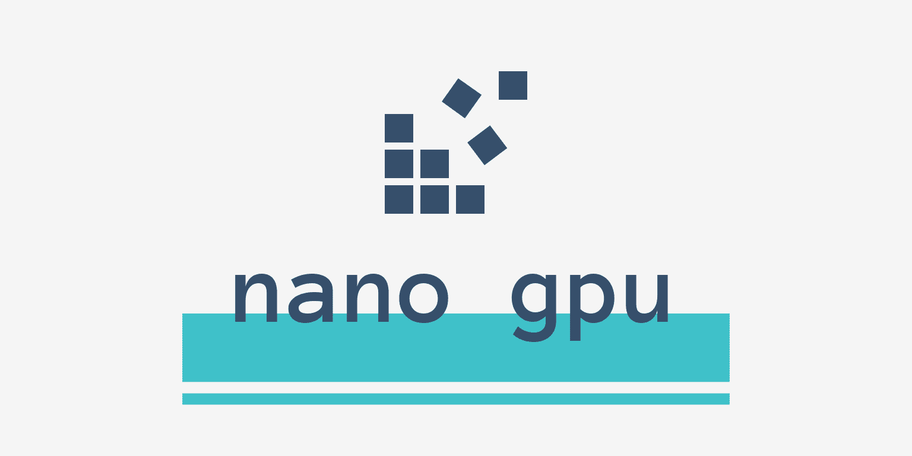

# Nano GPU Scheduler

<!-- ABOUT THE PROJECT -->
## About This Project
With the continuous evolution of cloud native AI scenarios, more and more users run AI tasks on Kubernetes, which also brings more and more challenges to GPU resource scheduling. 

*Nano gpu scheduler* is a gpu scheduling framework based on Kubernetes, which focuses on fine-grained gpu resource scheduling and allocation.

You may also be interested in *Nano GPU Agent* which is a Kubernetes device plugin implement.

## Motivation
In the GPU container field, GPU providers such as nvidia have introduced a docker-based gpu containerization project that allows users to use GPU cards in Kubernetes Pods via the Kubernetes extended resource with the nvidia k8s device plugin. However, this project focuses more on how containers use GPU cards on Kubernetes nodes, and not on GPU resource scheduling.

Nano GPU scheduler is based on Kubernetes extended scheduler, which can schedule gpu cores, memories, percents, share gpu with multiple containers and even spread containers of pod to different GPUs. The scheduling algorithm supports binpack, spread, random and other policies. In addition, through the supporting nano gpu agent, it can be adapted to nvidia docker, gpushare, qgpu and other gpu container solutions. Nano GPU scheduler mainly satisfies the GPU resources scheduling and allocation requirements in Kubernetes.

## Architecture


## Prerequisites
- Kubernetes v1.17+
- golang 1.16+
- [NVIDIA drivers](https://github.com/NVIDIA/nvidia-docker/wiki/Frequently-Asked-Questions#how-do-i-install-the-nvidia-driver) 
- [nvidia-docker](https://github.com/NVIDIA/nvidia-docker) 
  
## Getting Started
1. Create RBAC
```
$ kubectl apply -f deploy/nano-gpu-rbac.yaml
```
2. Deploy Nano GPU Agent
```
$ kubectl apply -f deploy/nano-gpu-agent-ds.yaml
```
3. Deploy Nano GPU Scheduler
```
$ kubectl apply -f deploy/nano-gpu-scheduler-deploy.yaml
```
4. Enable Kubernetes scheduler extender
Add the following configuration to `extender` in `/etc/kubernetes/scheduler-policy-config.json`:
```
{
  "urlPrefix": "http://<kube-apiserver-svc>/api/v1/namespaces/kube-system/services/<nano-gpu-scheduler-svc>/proxy/scheduler",
  "filterVerb": "filter",
  "prioritizeVerb": "priorities",
  "bindVerb": "bind",
  "weight": 1,
  "enableHttps": false,
  "nodeCacheCapable": true,
  "managedResources": [
    {
      "name": "nano-gpu/gpu-percent"
    }
  ]
}
```

You can set a scheduling policy by running `kube-scheduler --policy-config-file <filename>` or `kube-scheduler --policy-configmap <ConfigMap>`. Here is a [scheduler policy config sample](https://github.com/kubernetes/examples/blob/master/staging/scheduler-policy/scheduler-policy-config.json).

5. Create GPU pod
```
apiVersion: apps/v1
kind: Deployment
metadata:
  name: cuda-10c
  labels:
    app: gpu-test
spec:
  replicas: 3
  selector:
    matchLabels:
      app: gpu-test
  template:
    metadata:
      labels:
        app: gpu-test
    spec:
      containers:
        - name: cuda
          image: nvidia/cuda:10.0-base
          command: [ "sleep", "100000" ]
          resources:
            limits:
              nano-gpu.io/gpu-percent: "20" // 20% GPU

```

<!-- ROADMAP -->
## Roadmap
- Support GPU share
- Support GPU monitor at pod and container level
- Support single container multi-card scheduling
- Support GPU topology-aware scheduling
- Support GPU load-aware scheduling
- Migrate to Kubernetes scheduler framework

<!-- LICENSE -->
## License
Distributed under the Apache License.

